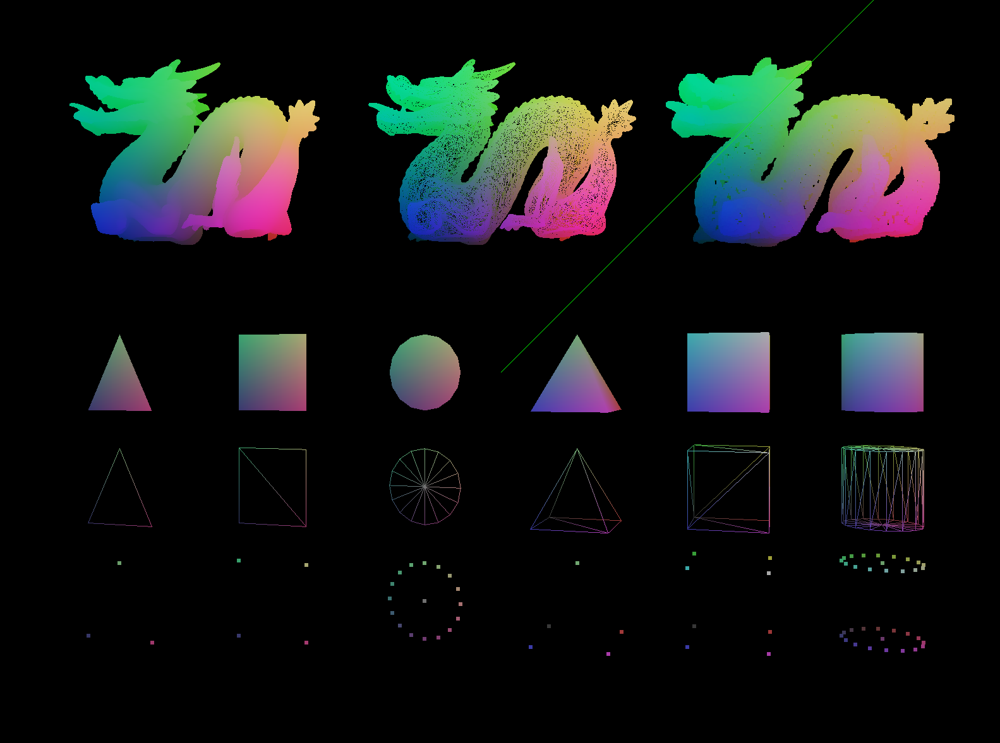

# Graphics Engine



Almost a simple graphics engine with OpenGL

Messing with OpenGL w/ [GLAD](https://glad.dav1d.de/#profile=core&language=c&specification=gl&loader=on&api=gl%3D4.6) & GLFW3 graphics concepts

### MacOS Setup

```bash
brew install glfw
./build.sh
./build/Renderer
```